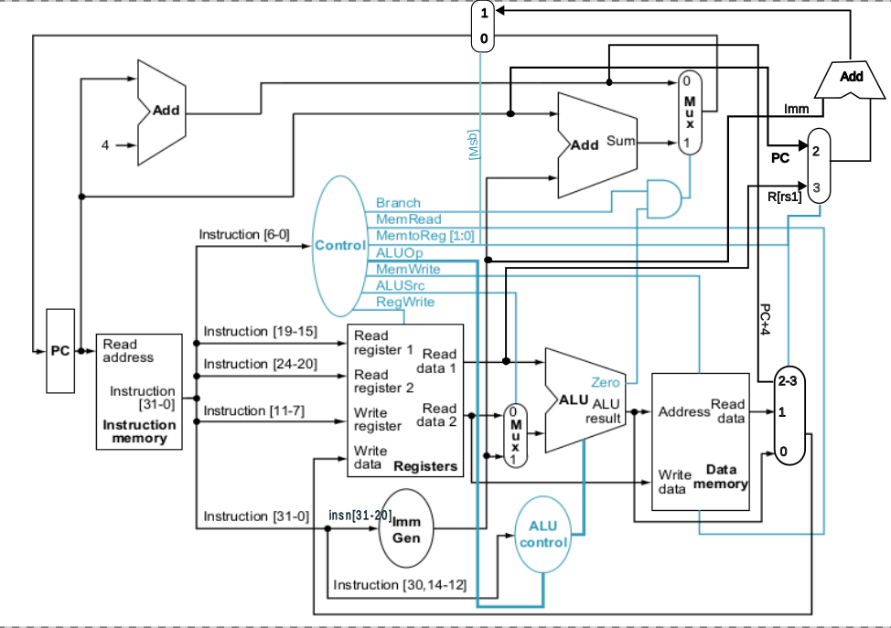
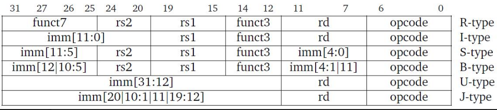
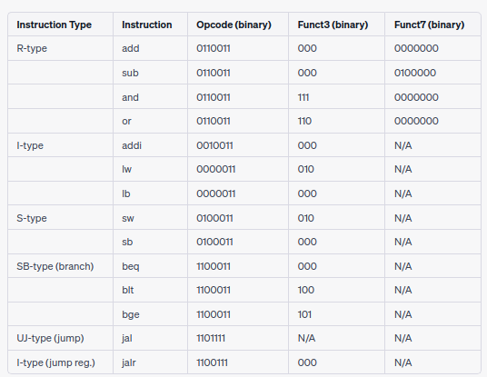
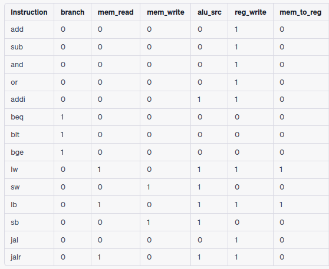

# 32bit-RiscV-implementation

RISC-V is an open-source instruction set architecture (ISA) designed for computer processors. It follows the Reduced Instruction Set Computing (RISC) principles, which emphasize simplicity and efficiency in instruction execution. 

This implementation includes support for the following instructions only:

### R-type Instructions
- `add rd, rs1, rs2`: Performs addition and stores the result in `rd` (rd = rs1 + rs2)
- `sub rd, rs1, rs2`: Performs subtraction and stores the result in `rd` (rd = rs1 - rs2)
- `and rd, rs1, rs2`: Performs bitwise AND and stores the result in `rd` (rd = rs1 & rs2)
- `or rd, rs1, rs2`: Performs bitwise OR and stores the result in `rd` (rd = rs1 | rs2)

### I-type Instructions
- `addi rd, rs1, imm`: Performs addition with an immediate value and stores the result in `rd` (rd = rs1 + imm)
- `lw rd, imm(rs1)`: Loads a word from memory and stores it in `rd` (rd = Memory[rs1 + imm])
- `lb rd, imm(rs1)`: Loads a byte from memory and stores it in `rd` (rd = Memory[rs1 + imm])

### S-type Instructions
- `sw rs2, imm(rs1)`: Stores a word into memory (Memory[rs1 + imm] = rs2)
- `sb rs2, imm(rs1)`: Stores a byte into memory (Memory[rs1 + imm] = rs2[7:0])

### B-type Instructions
- `beq rs1, rs2, imm`: Branches if the values in `rs1` and `rs2` are equal. Updates the program counter (PC) accordingly (PC = (rs1 == rs2) ? PC + imm : PC + 4)
- `blt rs1, rs2, imm`: Branches if the value in `rs1` is less than the value in `rs2`. Updates the program counter (PC) accordingly (PC = (rs1 < rs2) ? PC + imm : PC + 4)
- `bge rs1, rs2, imm`: Branches if the value in `rs1` is greater than or equal to the value in `rs2`. Updates the program counter (PC) accordingly (PC = (rs1 >= rs2) ? PC + imm : PC + 4)

### J-type Instructions
- `jal rd, imm`: Performs a jump and link operation. Stores the address of the next instruction in `rd` and updates the program counter (PC = PC + imm)

### I-type (Jump Register) Instructions
- `jalr rd, rs1, imm`: Performs a jump and link register operation. Stores the address of the next instruction in `rd` and updates the program counter (PC = (rs1 + imm) & ~1)

**NOTE: `lw` and `lb` instructions are called L type in code. They are I type with some diffrences, so i renamed them to L type for distinction.** 

## System Architecture
These diagrams illustrate the system hardware design, instruction format, instruction encoding, and control unit, all of which are integral parts of the system architecture. They collectively define how the RISC-V implementation operates and interacts with software and external devices.

### System Hardware Design
The system hardware design, as illustrated in the Design diagram, includes the various hardware components that make up the RISC-V implementation.


### Instruction Format
The Instruction Format diagram showcases the structure and format of the instructions in the RISC-V ISA. 


### Instruction Encoding
The Instruction Encoding diagram depicts the specific encoding schemes used to represent the instructions in binary format. 


### Control Unit
The Control diagram provides an overview of the control unit responsible for coordinating and controlling the execution of instructions in the processor. 


## Usage

To run the Verilog code and simulate the design, follow these steps:

### Prerequisites

Make sure you have the following software installed on your system:

- [Icarus Verilog (iverilog)](https://bleyer.org/icarus/)
- [GTKWave](https://gtkwave.sourceforge.net/)

### Simulation

1. Clone or download the repository to your local machine.
2. Navigate to the project directory containing the Verilog files.
3. Open a terminal or command prompt in the project directory.
4. Compile the Verilog files using `iverilog`. Run the following command:

   ```shell
   iverilog -o [module name].vvp [test bench name].v
   ```
5. Run the compiled file using. This produces a vcd file.
    ```shell
    vvp [module name].vvp
    ```
6. Run the vcd file produced to view the wave displaying the signals and their values over time.
    ```shell
    gtkwave [module name].vcd
    ```
   - You can zoom in/out, pan, and navigate through the waveform using the available controls.
   - You can select specific signals to display or customize the waveform view as per your requirements.
7. Analyze and inspect the waveforms to verify the correctness of your design and observe the behavior of different signals.

## Disclaimer
**Note: This project is a work in progress and may contain errors.**

Please be aware that the code and information provided in this repository are being actively developed and may not be entirely accurate or complete. While efforts have been made to ensure the correctness and reliability of the implementation, there is no guarantee of its functionality or suitability for any specific purpose.

Users are advised to exercise caution and perform thorough testing and validation before relying on the code for any critical applications. The authors and contributors of this project disclaim any liability for any loss or damage caused by the use or misuse of the code provided in this repository.

We welcome feedback, bug reports, and contributions from the community to help improve the quality and reliability of the project. Feel free to open issues or submit pull requests if you identify any issues or have suggestions for enhancements.

Thank you for your understanding and collaboration as we continue to develop and refine this project.